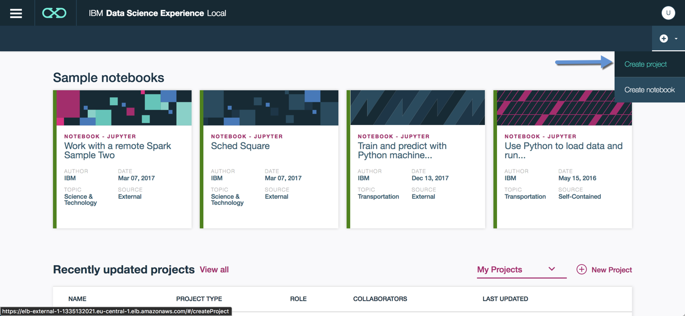
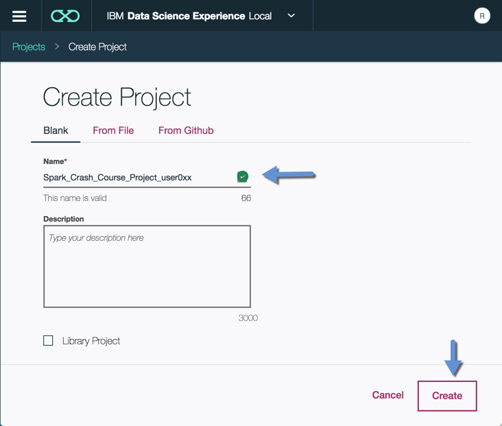
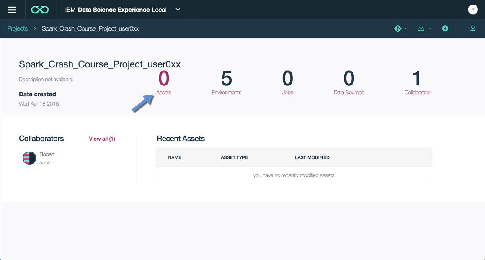
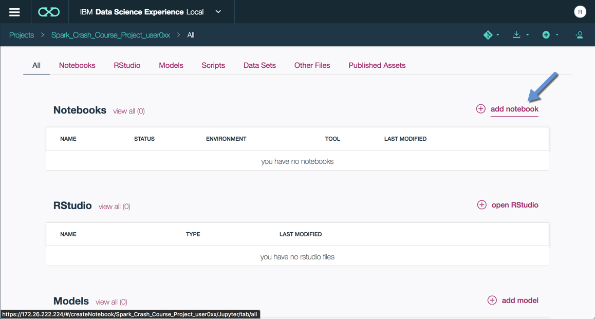
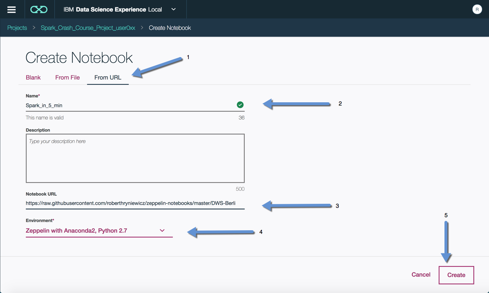
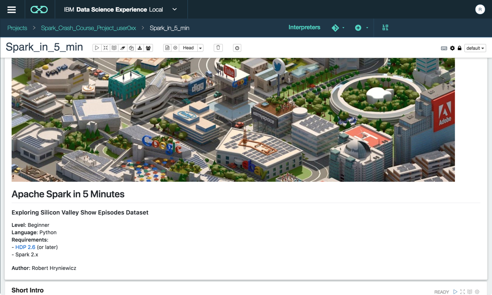

# DataWorksSummit2018_Spark
> https://dataworkssummit.com/berlin-2018/

## Apache Spark Crash Course

This repository contains the examples of sample Apache Spark exercise notebooks that I practice in the DataWorks Summit at Berlin.

## Get started fast with spark
> https://www.youtube.com/watch?v=4SIZNQ7KZX8

## Practicing Spark with online notebooks
- In this workshop we used 'Zepl', a Web-based notebook to get started with spark application. 
> https://www.zepl.com/USU1XQILT/spaces/S_ZEPL/d9f6f52521cb4ff5ad24851a5756d664

- Other solution to get start with Spark is to use Jupyter notebook from databricks community cloud.
> https://community.cloud.databricks.com/?o=4222224209897404

## Steps to load notebooks into 'zepl'.

- Click Create project in the top right-hand corner drop-down menu:

- Create a project with unique name by appending your username at the end :

- Click on Assets:

- Click add notebook:

-	Select From URL, type name Spark_in_5_min, In Notebook URL paste the notebook url from repo, i.e. *.ipynb , In Environment select Zeppelin with Anaconda2, Python 2.7, 	Click Create

- After a minute or two a Zeppelin notebook should load which will look like this:

